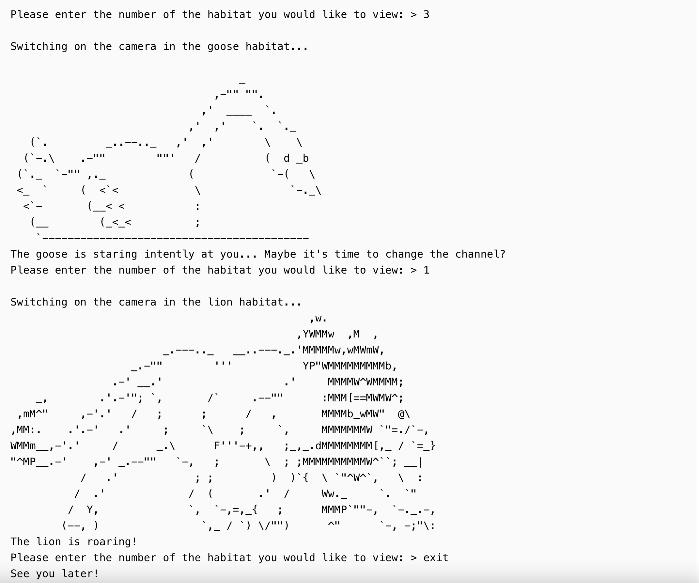

# Zookeeper

## Description
There are many animals in the zoo, and all of them need care. The animals must be fed, cleaned, surrounded by their kin, and kept happy. That is a difficult task for our large zoo, so one of your employers has suggested a more convenient way to keep track of everything. She wants to be able to pull up a video feed of any animal in the zoo with the help of a program. Being able to check on each habitat would help the zookeepers take care of our furry friends more efficiently!

In this project, you will create a program that helps the zookeepers check on the animals and make sure that they're doing well. Your product will be able to process commands from the zookeepers and display the animals on a monitor

### Objectives
`Your tasks at this point:`

1. Your program should repeat the behavior from the previous stage, but now in a loop.

2. Do not forget to include an exit opportunity: inputting exit should end the program.

3. When the program is done running, it should print: See you later!

### Examples
The greater-than symbol followed by a space (> ) represents the user input. Note that it's not part of the input.

The final version of the program should run like this:

Example 1 <b>

